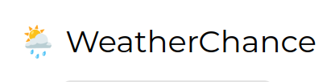
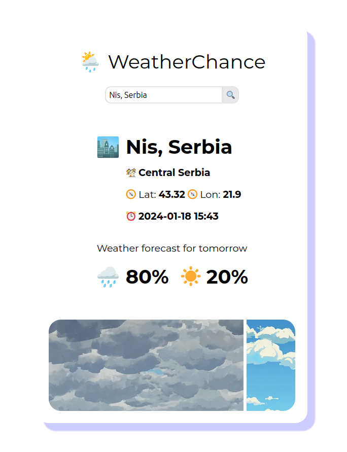
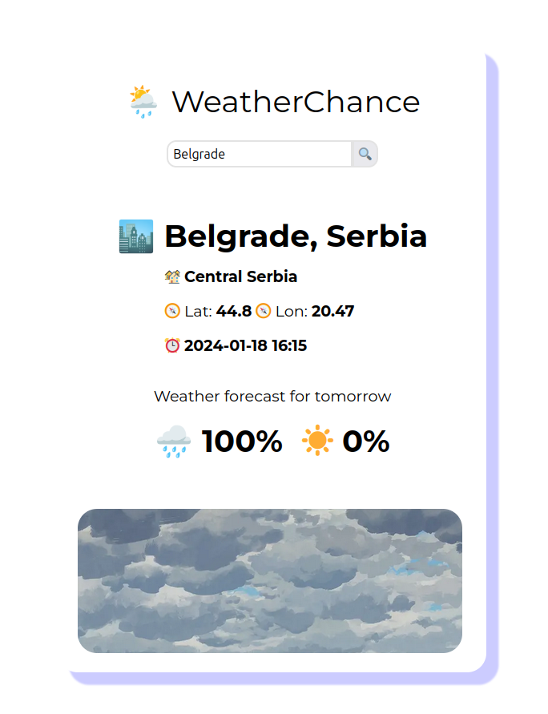
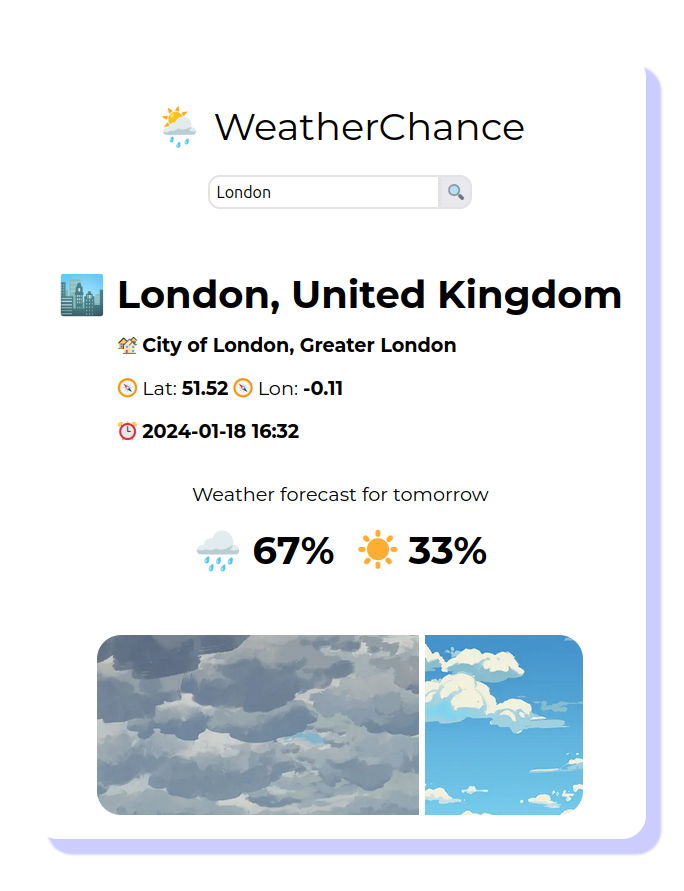

# WeatherChance App

WeatherChance is an open-source application that can predict whether the tomorrows weather of particular queried location/city will be good or bad. Good weather is essentially defined as sunny and less cloudly and bad weather is defined as rainy, snowy etc. It's called WeatherChance because it returns whether the weather will be bad or good in percentages.

## How to start

To locally start this project, we need to prepare the environments by supplying needed variables. In `/src/api` create a `.env` file with following contents:

```
WEATHER_API_KEY=<api_key>
PORT=<port>
ENV=<production | development>
```

Make sure you have `flask`, `flask_cors` and `waitress` installed. Then run `run.py` and server should start ( don't worry if you don't see any logs for `production` ).

You can get `WEATHER_API_KEY` for free from WeatherAPI and get 1,000,000 calls/month for free. In `/src/web` create a `.env` file with following content:

```
NEXT_PUBLIC_API_URL=<api_url>
```

Then run `npm i` and then `npm run dev` or `npm build && npm start` and it should run the web application.

## How it works

WeatherChange API internals utilize concept of [Markov models](https://en.wikipedia.org/wiki/Markov_chain) called Markov chain. Markov chain essentially is defined as a stochastic model that describes a sequence of possible events in which the probability of each event depends only on the state attained in the previous event. This can be helpful in creating various probabilities of the next state.

When an forecast is requested, API downloads maximum allowed sample size from an external source ( WeatherChance utilizes WeatherAPI with sample size of past 7 days ) which describes weather of previous dates. Once application has sample set it converts it to internally recognizable states of `0` and `1` ( `0` being bad weather, `1` being good weather ). Set of states is then used to create [transition matrix](https://en.wikipedia.org/wiki/Stochastic_matrix) needed for final probability calculation. Then, last state from state set is used in querying the matrix for the final probability results.

## Improvements

This project can be improved in various different ways but I wanted to keep it as simple as it is and wanted to test how this type of application ( weather forecasting ) can utilize Markov chains. At the end, this project as it is works as intended, it showcases whether the weather will be bad or good and it's pretty good at it considering it does training in real time/during runtime. Chances/percentages might be off but generally it's good at creating a probability about what type of weather might be tomorrow.

## Screenshots




